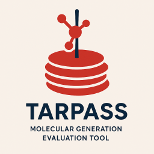

# TarPass

<div align="center">
    
</div>

TarPass is a comprehensive benchmark designed for target-aware *de novo* molecular generation.

## Quick Setup

```bash
conda env create -f tarpass.yml
conda activate tarpass
pip install -e .
```

⚠️ It should be noted that the packages required for running Jupyter Notebook are not included.

⚠️ We strongly recommend running it on devices with a GPU.

### Docking with Gnina (Suggested)

<details>
<summary>Click to expand setup instructions</summary>

We highly suggest performing docking with Gnina (Version 1.3).  
You can [download](https://github.com/gnina/gnina/releases/tag/v1.3) Gnina or:

```bash
wget https://github.com/gnina/gnina/releases/download/v1.3/gnina
```

Then add Gnina to the system path by modifying `~/.bashrc`.

```bash
export PATH=<GNINA_PATH>:$PATH
# Change <GNINA_PATH> to your own path!
export PYTHONUNBUFFERED=1
```

</details>

### Docking with AutoDock-Vina (Deprecated, NOT suggested)

<details>
<summary>Click to expand setup instructions</summary>

```bash
conda install -c conda-forge swig boost-cpp libboost sphinx sphinx_rtd_theme
conda install -c conda-forge vina gemmi prody
conda install -c conda-forge autogrid # >=4.2.7
```

### Preparation with AutoDock-Vina (Not Recommend)

```bash
python -m pip install git+https://github.com/Valdes-Tresanco-MS/AutoDockTools_py3
```

For other dependency file, please download [autodock_depends.zip](wait for update) and copy to `dock`, then run:

```bash
cd dock
unzip autodock_depends.zip
```

</details>

## Input folder structure
>
> **Warning**  
> We strongly recommend that you place the molecule files to be tested according to the following folder structure.  
> We only accept SDF format files as input for 3D molecules, as reading molecules in MOL or MOL2 format may result in the loss of stereochemical information.
> For SMILES format input, most of file formats (e.g. `.smi` or `.txt`) are acceptable.

```text
test_folder
├── 5HT2A
│   ├── 1.sdf (or smi format, it's also acceptable to store all molecules in a single file)
│   ├── 2.sdf
│   └── ...
│ 
├── 5HT2A-AF
│   ├── 1.sdf
│   └── ...
└── ...
```

<details>
<summary>After the testing is completed, the file structure should be as follows:</summary>

```text
test_folder
├── 5HT2A
│   ├── results
│   │   ├── xx_docking_results.pkl
│   │   ├── xx_results.json
│   │   └──...
│   ├── 1.sdf
│   └── ...
└── ...
```

</details>

## Usage

The simplest process for benchmarking with **default** settings is as follows:

```text
Packaing generated molecules in designated format -> docking -> evaluation -> analysis -> collecting results (Option)
```

The following sequence must be strictly followed:
***

### Docking

```bash
tarpass -p <path> dock
```

On devices equipped with GPUs, completing docking across all 20 proteins requires more than 16 hours, with the exact time depending on the number of molecules and the hardware performance.  

After execution, pkl files `xx-dock_docking_results.pkl` or `xx-score_only_docking_results.pkl` (3D only) containing docking scores, and docking poses will be generated under the `<target>/results` directory.

***

### Evaluation

```bash
tarpass -p <path> eval
```

After execution, a json file `dock_eval_results.json` with PLI-related results and a csv file `mole_eval_results.csv` for molecular properties will be generated under the `<target>/results` directory.

***

### Analysis

>**Warning**  
>`Reference_eval_results.pkl` and `Random_eval_results.pkl` must be placed in the `data` folder, which can be obtained from [here](test).

```bash
tarpass -p <path> analysis
```

After execution, a series of csv files of analysis results will be save at `<path>`.

***

### Collection

```bash
tarpass -p <path> collect
```

After running, the results of eval will be saved in `xx_eval_results.pkl` under `<path>`

***

### CLI Help

```text
tarpass [-n NUM] -p PATH {module} --option

options:
  -n NUM, --num NUM     number of unique molecules to verify per target (default: 1000).
  -p PATH, --path PATH  path to the folder where generated molecules for testing will be stored.

  {module}     modules that need to be executed: dock, interactions, dock_eval, etc.
  --option     Options specific to each module, which may vary between modules.
```
