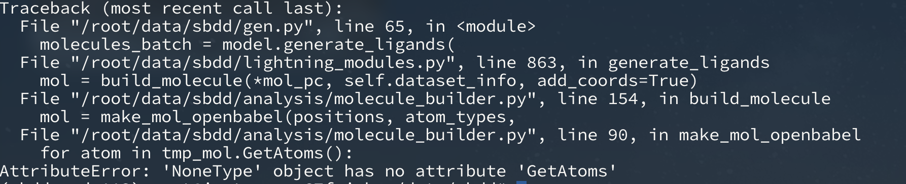

## 3.4

今天在尝试复现TamGen模型

- 按照给定脚本安装env，遇到安装很久很慢的问题，应该只能等待（）
  - 发现是libcufft一直无法install，重新运行脚本
- libcufft版本更新导致无法安装原始版本（11.0.2.4），我直接安装了11.2.1.3，不知道会不会有问题


- 构建训练数据，我是直接按照data/README.md的描述安装的
    - 已解决：不需要自己训练，只用跑生成


## SurfGen

- Numpy版本过高，尝试downgrade，解决

- 将pdb文件转换到cif文件：https://mmcif.pdbj.org/converter/index.php?l=en


## DiffSBDD

- pytorch_scattter又爆了

```bash
conda install -c pyg pytorch-scatter
Channels:
 - pyg
 - https://mirrors.tuna.tsinghua.edu.cn/anaconda/pkgs/main
 - https://mirrors.tuna.tsinghua.edu.cn/anaconda/pkgs/free
 - https://mirrors.tuna.tsinghua.edu.cn/anaconda/cloud/pytorch
 - defaults
Platform: linux-64
Collecting package metadata (repodata.json): done
Solving environment: failed

LibMambaUnsatisfiableError: Encountered problems while solving:
  - nothing provides python_abi 3.6.* *_cp36m needed by pytorch-scatter-2.0.8-py36_torch_1.8.0_cpu

Could not solve for environment specs
The following packages are incompatible
├─ pin on python 3.13.* =* * is installable and it requires
│  └─ python =3.13 *, which can be installed;
└─ pytorch-scatter =* * is not installable because there are no viable options
   ├─ pytorch-scatter [2.0.8|2.0.9] would require
   │  └─ python_abi =3.6 *_cp36m, which does not exist (perhaps a missing channel);
   ├─ pytorch-scatter [2.0.8|2.0.9] would require
   │  └─ python_abi =3.7 *_cp37m, which does not exist (perhaps a missing channel);
   ├─ pytorch-scatter [2.0.8|2.0.9] would require
   │  └─ cudatoolkit =11.1 *, which does not exist (perhaps a missing channel);
   ├─ pytorch-scatter [2.0.8|2.0.9] would require
   │  └─ python_abi =3.8 *_cp38, which does not exist (perhaps a missing channel);
   ├─ pytorch-scatter [2.0.8|2.0.9] would require
   │  └─ python_abi =3.9 *_cp39, which does not exist (perhaps a missing channel);
   ├─ pytorch-scatter [2.0.9|2.1.0|2.1.1|2.1.2] would require
   │  └─ python >=3.8,<3.9.0a0 *, which conflicts with any installable versions previously reported;
   ├─ pytorch-scatter [2.0.9|2.1.0|2.1.1] would require
   │  └─ python >=3.7,<3.8.0a0 *, which conflicts with any installable versions previously reported;
   ├─ pytorch-scatter [2.0.9|2.1.0|2.1.1|2.1.2] would require
   │  └─ python >=3.9,<3.10.0a0 *, which conflicts with any installable versions previously reported;
   ├─ pytorch-scatter [2.0.9|2.1.0|2.1.1|2.1.2] would require
   │  └─ python >=3.10,<3.11.0a0 *, which conflicts with any installable versions previously reported;
   ├─ pytorch-scatter 2.0.9 would require
   │  └─ cudatoolkit =11.5 *, which does not exist (perhaps a missing channel);
   ├─ pytorch-scatter [2.0.9|2.1.0] would require
   │  └─ cudatoolkit =11.6 *, which does not exist (perhaps a missing channel);
   ├─ pytorch-scatter [2.0.9|2.1.0] would require
   │  └─ pytorch-cuda =11.6 *, which requires
   │     └─ cuda =11.6 *, which does not exist (perhaps a missing channel);
   ├─ pytorch-scatter [2.0.9|2.1.0|2.1.1|2.1.2] would require
   │  └─ pytorch-cuda =11.7 * but there are no viable options
   │     ├─ pytorch-cuda 11.7 would require
   │     │  └─ cuda-cudart >=11.7,<11.8 *, which does not exist (perhaps a missing channel);
   │     └─ pytorch-cuda 11.7 would require
   │        └─ cuda =11.7 *, which does not exist (perhaps a missing channel);
   ├─ pytorch-scatter [2.1.1|2.1.2] would require
   │  └─ pytorch-cuda =11.8 * but there are no viable options
   │     ├─ pytorch-cuda 11.8 would require
   │     │  └─ cuda-cudart >=11.8,<12.0 *, which does not exist (perhaps a missing channel);
   │     └─ pytorch-cuda 11.8 would require
   │        └─ cuda =11.8 *, which does not exist (perhaps a missing channel);
   ├─ pytorch-scatter 2.1.2 would require
   │  └─ python >=3.11,<3.12.0a0 *, which conflicts with any installable versions previously reported;
   ├─ pytorch-scatter 2.1.2 would require
   │  └─ pytorch-cuda =12.1 *, which requires
   │     └─ cuda-cudart >=12.1,<12.2 *, which does not exist (perhaps a missing channel);
   └─ pytorch-scatter 2.1.2 would require
      └─ python >=3.12,<3.13.0a0 *, which conflicts with any installable versions previously reported.

Pins seem to be involved in the conflict. Currently pinned specs:
 - python=3.13

```

原版的python是3.10.4，我安装的版本过高了，是3.13，现在尝试降级，但是发现rdkit版本太高了，也得降级

等等，好像不用。找conda-forge官方文档中的命令好像就可以安装了。


- openbabel爆了

python13版本还是太高了啊

```bash
conda install conda-forge::openbabel
Channels:
 - https://mirrors.tuna.tsinghua.edu.cn/anaconda/pkgs/main
 - https://mirrors.tuna.tsinghua.edu.cn/anaconda/pkgs/free
 - https://mirrors.tuna.tsinghua.edu.cn/anaconda/cloud/pytorch
 - defaults
 - conda-forge
Platform: linux-64
Collecting package metadata (repodata.json): done
Solving environment: failed

LibMambaUnsatisfiableError: Encountered problems while solving:
  - package openbabel-2.4.1-py27hc189817_0 requires python >=2.7,<2.8.0a0, but none of the providers can be installed

Could not solve for environment specs
The following packages are incompatible
├─ openbabel =* * is installable with the potential options
│  ├─ openbabel 3.1.1 would require
│  │  └─ python >=3.10,<3.11.0a0 *, which can be installed;
│  ├─ openbabel 3.1.1 would require
│  │  └─ python >=3.11,<3.12.0a0 *, which can be installed;
│  ├─ openbabel 3.1.1 would require
│  │  └─ python [>=3.12,<3.13.0a0 *|>=3.12.0rc3,<3.13.0a0 *], which can be installed;
│  ├─ openbabel [3.0.0|3.1.0|3.1.1] would require
│  │  └─ python >=3.8,<3.9.0a0 *, which can be installed;
│  ├─ openbabel 3.1.1 would require
│  │  └─ python >=3.9,<3.10.0a0 *, which can be installed;
│  ├─ openbabel [2.4.1|3.0.0] would require
│  │  └─ python >=2.7,<2.8.0a0 *, which can be installed;
│  ├─ openbabel [2.4.1|3.0.0|3.1.0|3.1.1] would require
│  │  └─ python >=3.6,<3.7.0a0 *, which can be installed;
│  └─ openbabel [2.4.1|3.0.0|3.1.0|3.1.1] would require
│     └─ python >=3.7,<3.8.0a0 *, which can be installed;
└─ pin on python 3.13.* =* * is not installable because it requires
   └─ python =3.13 *, which conflicts with any installable versions previously reported.

Pins seem to be involved in the conflict. Currently pinned specs:
 - python=3.13
```

发现py12支持度还是可以的，试一下装12，好像可以了

### Run

- pytorch_lightning没有（？

    尝试安装，发现只支持到python3.9，但是3.9的不支持
    
    只能将openbabel scatter rdkit全部删除

    好了现在没有这个报错了


- 跑起来

发现又有问题。。。

```bash
Traceback (most recent call last):
  File "/root/data/sbdd/generate_ligands.py", line 4, in <module>
    import torch
  File "/opt/miniconda3/envs/sbdd-env/lib/python3.9/site-packages/torch/__init__.py", line 290, in <module>
    from torch._C import *  # noqa: F403
ImportError: /opt/miniconda3/envs/sbdd-env/lib/python3.9/site-packages/torch/lib/libtorch_cpu.so: undefined symbol: iJIT_NotifyEvent
```

似乎是torch和cuda不兼容，尝试降级cuda到11.3

乱七八糟试了一通那个问题不见了 出现了新的问题：

```bash
python generate_ligands.py checkpoints/crossdocked_fullatom_cond.ckpt --pdbfile example/3rfm.pdb --outfile example/3rfm_mol.sdf --ref_ligand A:330 --n_samples 5
Traceback (most recent call last):
  File "/root/data/sbdd/generate_ligands.py", line 8, in <module>
    import utils
  File "/root/data/sbdd/utils.py", line 6, in <module>
    from rdkit import Chem
  File "/opt/miniconda3/envs/sbdd-cuda113/lib/python3.9/site-packages/rdkit/Chem/__init__.py", line 16, in <module>
    from rdkit.Chem import rdchem
ImportError: /lib/x86_64-linux-gnu/libstdc++.so.6: version `GLIBCXX_3.4.31' not found (required by /opt/miniconda3/envs/sbdd-cuda113/lib/python3.9/site-packages/rdkit/Chem/../../../../libboost_serialization.so.1.86.0)
```

已解决：https://stackoverflow.com/questions/54948216/usr-lib-x86-64-linux-gnu-libstdc-so-6-version-glibcxx-3-4-21-not-found-req/55899959#55899959


- 报错了

```bash
python generate_ligands.py checkpoints/crossdocked_fullatom_cond.ckpt --pdbfile example/3rfm.pdb --outfile example/3rfm_mol.sdf --ref_ligand A:330 --n_samples 5

A module that was compiled using NumPy 1.x cannot be run in
NumPy 2.0.2 as it may crash. To support both 1.x and 2.x
versions of NumPy, modules must be compiled with NumPy 2.0.
Some module may need to rebuild instead e.g. with 'pybind11>=2.12'.

If you are a user of the module, the easiest solution will be to
downgrade to 'numpy<2' or try to upgrade the affected module.
We expect that some modules will need time to support NumPy 2.

Traceback (most recent call last):  File "/root/data/sbdd/generate_ligands.py", line 9, in <module>
    from lightning_modules import LigandPocketDDPM
  File "/root/data/sbdd/lightning_modules.py", line 11, in <module>
    import pytorch_lightning as pl
  File "/opt/miniconda3/envs/sbdd-cuda113/lib/python3.9/site-packages/pytorch_lightning/__init__.py", line 27, in <module>
    from pytorch_lightning.callbacks import Callback  # noqa: E402
  File "/opt/miniconda3/envs/sbdd-cuda113/lib/python3.9/site-packages/pytorch_lightning/callbacks/__init__.py", line 14, in <module>
    from pytorch_lightning.callbacks.batch_size_finder import BatchSizeFinder
  File "/opt/miniconda3/envs/sbdd-cuda113/lib/python3.9/site-packages/pytorch_lightning/callbacks/batch_size_finder.py", line 24, in <module>
    from pytorch_lightning.callbacks.callback import Callback
  File "/opt/miniconda3/envs/sbdd-cuda113/lib/python3.9/site-packages/pytorch_lightning/callbacks/callback.py", line 22, in <module>
    from pytorch_lightning.utilities.types import STEP_OUTPUT
  File "/opt/miniconda3/envs/sbdd-cuda113/lib/python3.9/site-packages/pytorch_lightning/utilities/types.py", line 40, in <module>
    from torchmetrics import Metric
  File "/opt/miniconda3/envs/sbdd-cuda113/lib/python3.9/site-packages/torchmetrics/__init__.py", line 37, in <module>
    from torchmetrics import functional  # noqa: E402
  File "/opt/miniconda3/envs/sbdd-cuda113/lib/python3.9/site-packages/torchmetrics/functional/__init__.py", line 122, in <module>
    from torchmetrics.functional.text._deprecated import _bleu_score as bleu_score
  File "/opt/miniconda3/envs/sbdd-cuda113/lib/python3.9/site-packages/torchmetrics/functional/text/__init__.py", line 17, in <module>
    from torchmetrics.functional.text.chrf import chrf_score
  File "/opt/miniconda3/envs/sbdd-cuda113/lib/python3.9/site-packages/torchmetrics/functional/text/chrf.py", line 32, in <module>
    _EPS_SMOOTHING = tensor(1e-16)
/opt/miniconda3/envs/sbdd-cuda113/lib/python3.9/site-packages/torchmetrics/functional/text/chrf.py:32: UserWarning: Failed to initialize NumPy: _ARRAY_API not found (Triggered internally at  ../torch/csrc/utils/tensor_numpy.cpp:68.)
  _EPS_SMOOTHING = tensor(1e-16)
Traceback (most recent call last):
  File "/root/data/sbdd/generate_ligands.py", line 9, in <module>
    from lightning_modules import LigandPocketDDPM
  File "/root/data/sbdd/lightning_modules.py", line 15, in <module>
    from Bio.PDB.Polypeptide import three_to_one
ImportError: cannot import name 'three_to_one' from 'Bio.PDB.Polypeptide' (/opt/miniconda3/envs/sbdd-cuda113/lib/python3.9/site-packages/Bio/PDB/Polypeptide.py)
```

应该是numpy版本太高了，尝试downgrade，已解决

- biopython缺少three_to_one：

```bash
python generate_ligands.py checkpoints/crossdocked_fullatom_cond.ckpt --pdbfile example/3rfm.pdb --outfile example/3rfm_mol.sdf --ref_ligand A:330 --n_samples 5
Traceback (most recent call last):
  File "/root/data/sbdd/generate_ligands.py", line 9, in <module>
    from lightning_modules import LigandPocketDDPM
  File "/root/data/sbdd/lightning_modules.py", line 15, in <module>
    from Bio.PDB.Polypeptide import three_to_one
ImportError: cannot import name 'three_to_one' from 'Bio.PDB.Polypeptide' (/opt/miniconda3/envs/sbdd-cuda113/lib/python3.9/site-packages/Bio/PDB/Polypeptide.py)
```
改用1.80版本的biopython，已解决

- runtimeerror

```bash
RuntimeError: CUDA out of memory. Tried to allocate 96.01 GiB (GPU 0; 23.64 GiB total capacity; 2.60 GiB already allocated; 19.60 GiB free; 2.82 GiB reserved in total by PyTorch) If reserved memory is >> allocated memory try setting max_split_size_mb to avoid fragmentation.  See documentation for Memory Management and PYTORCH_CUDA_ALLOC_CONF
```

### Record

bs设置为100 跑10000时出现报错

将bs设置为32 跑12800正常：


15:56 开始

没有重定向 并且显存使用率太低 改变bs

bs = 64 好起来了 现在使用率在90左右

使用logging和time模块记录时间，下次可以加一个tdqm


- 遇到报错

出现了一些情况导致每次生成会中断，但也不会每次都中断，比如5HT2A就只在batch1中断了，但是其他的都有好几个batch生成失败



